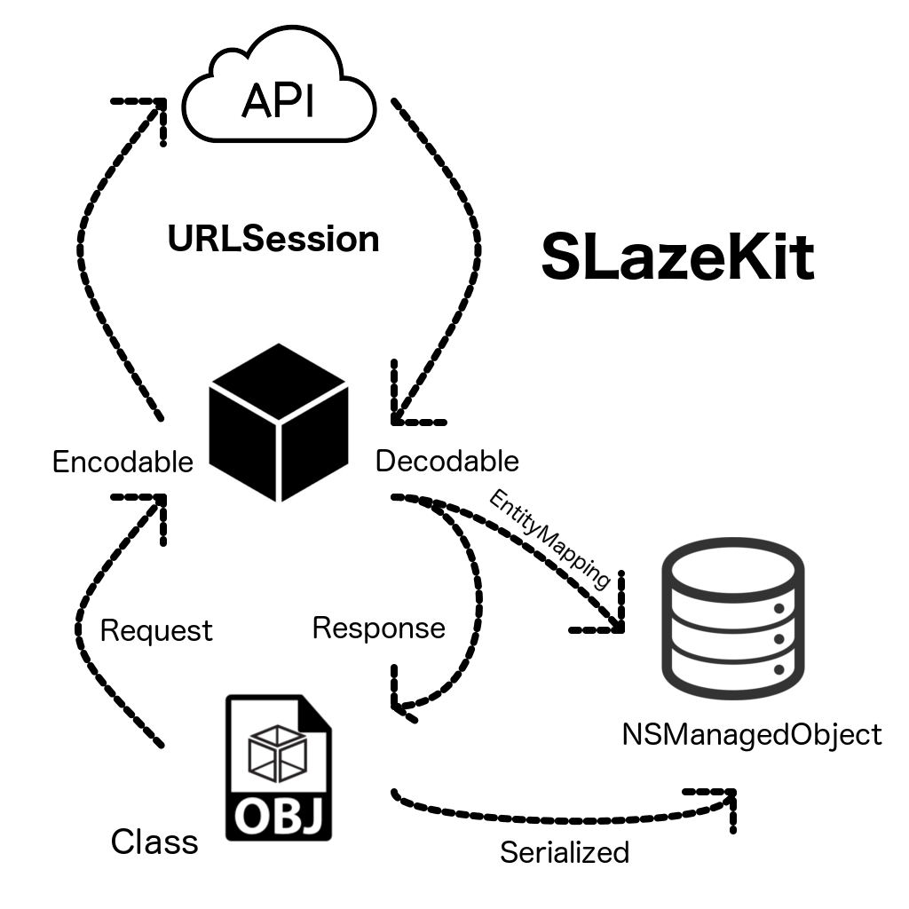

# SLazeKit

<p align="center">
    <a href="http://swift.org">
        
        </a>
        <a href="https://raw.githubusercontent.com/shial4/SLazeKit/master/LICENSE">
            
        </a>
        <a href="https://cocoapods.org/pods/SLazeKit">
            
        </a>
        <a href="https://github.com/Carthage/Carthage">
            
        </a>
</p>

SLazeKit is an easy to use Swift restful collection of extensions and classes. Don't spend hours writing your code to map your rest api request into models and coredata serialization. Stop wasting your time!

**SLazeKit allows you:**
- map your models by  `Codable` protocol
- serialize `CoreData` models from API response
- fast and simple extend your models with `API` & `CoreData`

<p align="center">

</p>

- This request will use default configuration scheme.
- The type `ResponseModel` is a result object type for result callback argument. If you want to decode array you simple execute method on `[ResponseModel]` type.
- The `error`  indicates why the request failed, or nil if the request was successful. it include `EntityMaping` errors, url preparation error and so on. If a response from the server is received, regardless of whether the request completes successfully or fails, the response parameter contains that information.
- The `response` provides tuple with  HTTPURLResponse object and the data returned by the server.
- The request handler is executed on the `URLSession` delegate queue.
```swift
class func getRequest(for modelId: String, success: @escaping ((Model?) ->()), failure: (() ->())? = nil) throws {
    let _ = ResponseModel.get(path: PathPattern.model.patternToPath(with: ["modelId":modelId])) { (response, result, error) in
    guard response?.urlResponse?.statusCode == 200 && error == nil else {
        failure?()
        return
    }
    success(try result?.serialized(SLazeKit.newBackgroundContext()) as? Model)
    }
}
```

If `ResponseModel` conforms to `EntityMapping` protocol it will be synchronize with CoreData. That means if mode object already exist it will update it or create new instance and fill `NSManagedObject` with response data. You can serialize your response to receive `CoreData` object on given context by:

```swift
try result?.serialized(NSManagedObjectContext) as? Model)
```

Calling this method simple query `NSManagedObject` which was synchronize before by given object id.

**Models example**

Simple
[Object.swift](Tests/SLazeKitTests/Models/Object.swift)
Advance
[Model.swift](Tests/SLazeKitTests/Models/Model.swift)

In case of any other configuration you can use `Laze`

```swift
//Laze<C: LazeConfiguration, D: Decodable>
Laze<Default, ResponseModel>.get( // Default configuration, result in ResponseModel model
SLazeKit<Default>.get( // Default configuration, no result model
ResponseModel.get( // Default configuration, result in ResponseModel model
```

## 🔧 Installation

**CocoaPods:**

Add the line `pod "SLazeKit"` to your `Podfile`

**Carthage:**

Add the line `github "shial4/SLazeKit"` to your `Cartfile`

**Manual:**

Clone the repo and drag the folder `SLazeKit` into your Xcode project.

**Swift Package Manager:**

Add the line `.package(url: "https://github.com/shial4/SLazeKit.git", from: "0.1.6"),` to your `Package.swift`

**Swift Package Manager in your iOS Project:**
This project demonstrates a working method for using Swift Package Manager (SPM) to manage the dependencies of an iOS project.

<a href="https://github.com/j-channings/swift-package-manager-ios">Example of how to use SPM v4 to manage iOS dependencies</a>

## 💊 Usage

For positive experience, you should configure `SLazeKit` at first.

SLazeKit in default configuration uses `Default` class which conforms to `LazeConfiguration` protocol.
I do recommand extend `Default` configuration. Moreover , If you have more then one API in your project. You can create as many as needed configurations schemes by creating your own object which do conform to `LazeConfiguration` protocol.

```swift
import SLazeKit

extension Default {
    //Provide base path for your API requests.
    open class var basePath: String? { return "www.yourdomain.com" }
    //Additional you can set port for your requests.
    open class var basePort: Int? { return 8040  }
    //You can provide your own instance of JSONDecoder.
    open class var decoder: JSONDecoder { return JSONDecoder() }
    //You can customize instance of URLSession in here.
    open class var urlSession: URLSession { return URLSession.shared }
    
    //If you feel like to set header dor requests do it in here.
    open class func setup(_ request: URLRequest) -> URLRequest {
        var request: URLRequest = request
        request.setValue("Your token", forHTTPHeaderField: "X-Access-Token")
        request.setValue("application/json", forHTTPHeaderField: "Content-Type")
        return request
    }
    //If you feel like to monitor response. You can do it in here.
    open class func handle(_ response: HTTPURLResponse?) {
        if response?.statusCode == 401 {
            Client.logout()
        }
    }
    
    /// Required override of this method which will provide Context for bacground execution.
    ///
    /// - Returns: NSManagedObjectContext
    open class func newBackgroundContext() -> NSManagedObjectContext? { return nil }
}
```

## ⭐ Contributing

Be welcome to contribute to this project! :)

## ❓ Questions

Just create an issue on GitHub.

## 📝 License

This project was released under the [MIT](LICENSE) license.
